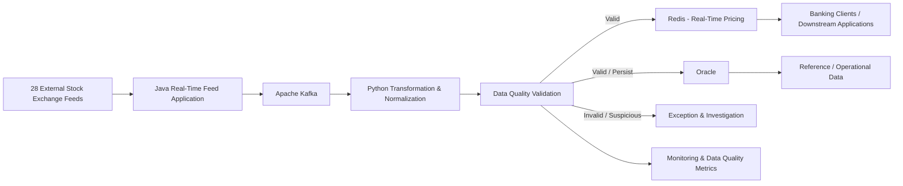

# Real-Time Market Pricing Data Platform

> **Portfolio Disclaimer**
>
> This repository is a generalized, portfolio-safe representation of an enterprise banking market-data use case. It contains no proprietary source code, exchange credentials, client data, production configuration, or confidential implementation details.

## Overview

This project represents a real-time market pricing platform used in the banking domain to consume pricing feeds from **28 external stock exchanges**, process and normalize the incoming market data, perform data-quality checks, and publish reliable real-time pricing information to downstream clients.

The application layer was implemented in **Java**, **Apache Kafka** was used for real-time streaming, **Python** was used for transformation logic, **Oracle** was used for persistent/reference data, and **Redis** was used for low-latency access to real-time pricing information.

Typical market-data attributes included:

- Bid price
- Ask price
- Open price
- Close price
- High price
- Low price
- Traded volume
- Instrument / security identifier
- Exchange
- Market timestamp

## Business problem

A banking market-data platform may receive real-time pricing information from many exchanges. Each source can have different:

- Message formats
- Field names
- Timestamp conventions
- Precision / scale
- Instrument identifiers
- Data-quality characteristics
- Market-status behaviour

The platform therefore needs to standardize incoming data and prevent bad market data from being distributed downstream.

## High-level architecture



## End-to-end processing flow

```text
28 External Stock Exchanges
          |
          v
   Java Feed Application
          |
          v
       Kafka
          |
          v
Python Transformation / Normalization
          |
          v
    Data Quality Checks
       /              PASS          FAIL
     |             |
     v             v
   Redis       Exception /
     |         Investigation
     v
Real-Time Client Pricing

Oracle supports persistent/reference/operational data required by the platform.
```

## Technology stack

| Layer | Technology | Purpose |
|---|---|---|
| Source feeds | External stock exchanges | Real-time market prices |
| Application | Java | Real-time feed processing/application layer |
| Streaming | Apache Kafka | Real-time event streaming |
| Transformation | Python | Transformation and normalization logic |
| Database | Oracle | Persistent/reference/operational data |
| Low-latency store | Redis | Fast access to current pricing data |
| Data quality | Application/Python validation logic | Detect incorrect/stale/inconsistent events |

## Why Kafka was used

Kafka provides a durable event-streaming layer between the Java feed-processing application and downstream processing.

Conceptually:

```text
Exchange Feed
     |
     v
Java Application
     |
     v
Kafka Topic
     |
     +--------------------+
     |                    |
     v                    v
Python Processing     Other Consumers
     |
     v
Data Quality
     |
     v
Redis / Oracle
```

This separation helps decouple the feed ingestion/application layer from downstream consumers.

## Core data-quality checks

The following checks represent the types of controls relevant to a real-time pricing platform.

### 1. Mandatory field validation

Required fields should be present before a market-data event is published.

Examples:

```text
instrument_id
exchange
bid_price
ask_price
event_timestamp
```

### 2. Price relationship validation

A basic market-data sanity check can identify cases such as:

```text
bid_price > ask_price
```

Such an event should be investigated rather than blindly distributed.

### 3. Stale-price detection

The platform should identify prices that have not changed within an expected period for an active market.

### 4. Timestamp validation

Incoming events should be checked for:

- Missing timestamps
- Invalid timestamps
- Unexpected future timestamps
- Excessive event delay

### 5. Duplicate-event detection

Repeated events may occur because of upstream retries or feed behaviour. The platform should have a strategy for detecting and handling duplicates.

### 6. Source / exchange validation

Each event should be associated with a known source and exchange.

### 7. Instrument validation

The security identifier should be checked against the appropriate reference-data source where available.

## Example normalized event

```json
{
  "instrument_id": "INS001",
  "exchange": "EXCHANGE_A",
  "currency": "USD",
  "bid_price": 101.25,
  "ask_price": 101.30,
  "open_price": 100.90,
  "high_price": 102.10,
  "low_price": 100.50,
  "close_price": 101.00,
  "volume": 125000,
  "event_timestamp": "2026-01-10T10:15:30.125Z"
}
```

The values above are synthetic examples.

## Data engineering responsibilities

This project highlights:

- Real-time market-data ingestion
- Kafka-based event streaming
- Multi-source data normalization
- Java application processing
- Python transformation logic
- Data-quality validation
- Exception handling
- Market-data freshness monitoring
- Duplicate detection
- Timestamp validation
- Instrument/reference-data validation
- Redis-based low-latency pricing access
- Oracle-based persistent/reference data
- Real-time downstream distribution
- Operational monitoring
- Incident investigation

## Data quality incident flow

```text
Incoming Market Event
        |
        v
Validation
        |
   +----+----+
   |         |
 Valid     Invalid
   |         |
   v         v
Redis /    Exception /
Oracle     Investigation
   |
   v
Client Pricing
```

## Example incident investigation

A downstream client reports that the displayed price for an instrument does not match another market source.

Investigation:

```text
Client Report
     |
     v
Identify instrument + exchange + timestamp
     |
     v
Check Kafka event
     |
     v
Check Java ingestion/application processing
     |
     v
Check Python transformation
     |
     v
Check validation result
     |
     v
Check Redis current value
     |
     v
Check Oracle/reference information where applicable
     |
     v
Compare source vs published values
     |
     v
Identify root cause
```

Possible root causes include:

- Upstream exchange feed issue
- Incorrect source mapping
- Instrument identifier mismatch
- Parsing issue
- Timestamp issue
- Stale event
- Duplicate event
- Transformation/normalization issue
- Redis value not refreshed
- Publication delay

## Why data quality is critical

Market pricing is time-sensitive. A technically available event is not necessarily a trustworthy event.

A stale or incorrect price can potentially affect:

- Client applications
- Valuation
- Trading workflows
- Risk calculations
- Analytics
- Market-data consumers

Therefore the platform needs both **low-latency distribution** and **strong data-quality controls**.

## Repository structure

```text
real-time-market-pricing-data-platform/
|
├── README.md
├── .gitignore
├── architecture/
│   ├── architecture.md
│   └── architecture.mmd
├── data-model/
│   └── normalized-market-event.md
├── data-quality/
│   ├── validation-rules.md
│   └── incident-management.md
├── sample-data/
│   ├── valid_market_events.json
│   └── invalid_market_events.json
├── docs/
│   ├── business-requirement.md
│   ├── processing-flow.md
│   └── engineering-decisions.md
└── technology/
    ├── kafka-design.md
    ├── java-application.md
    ├── python-transformation.md
    ├── redis-design.md
    └── oracle-design.md
```

## Interview discussion points

You can use this project to discuss:

- Why Kafka was used in the real-time architecture
- How multiple exchange feeds were handled
- How source-specific formats were normalized
- How to detect stale prices
- How to handle out-of-order events
- How to prevent bad market data from reaching clients
- How duplicate events can be detected
- How Java and Python responsibilities can be separated
- Why Redis is useful for current pricing
- What data belongs in Oracle
- How to monitor feed health
- How to detect an exchange feed interruption
- How to investigate a client-reported pricing discrepancy
- How replay and recovery could be designed

## Portfolio positioning

Use this project title on your GitHub profile:

> **Real-Time Market Pricing Data Platform — Banking Domain**

A concise resume/LinkedIn description could be:

> Designed and supported a real-time market-data processing platform consuming feeds from 28 external stock exchanges, using Java, Kafka, Python, Oracle and Redis to transform, validate and distribute time-sensitive pricing data to downstream banking clients.
